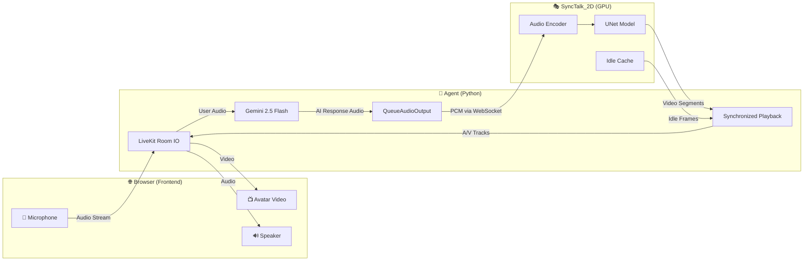

# 🧠 Real-Time Conversational AI Avatar Pipeline

A real-time, end-to-end conversational AI pipeline that lets users talk to an AI-powered avatar with **synchronized lip-sync video**. The system connects **Google Gemini 2.5 Flash** for voice AI, **LiveKit** for real-time media transport, and **SyncTalk_2D** for photorealistic lip-sync avatar rendering — all running in a browser-based frontend.


---

## 📌 Overview

This project is a **Final Year Design Project (FYDP)** that creates a full real-time conversation pipeline with a talking avatar. The user speaks into their microphone, the AI processes the speech and generates a spoken response, and a 2D avatar renders the response with perfectly lip-synced video — all in real time.

### High-Level Architecture

```
┌──────────────┐      ┌──────────────────────┐      ┌───────────────────┐
│   Frontend   │◄────►│    Agent (AI Engine)  │◄────►│   SyncTalk_2D     │
│  (Browser)   │      │   Gemini + LiveKit    │      │  (Avatar Server)  │
└──────────────┘      └──────────────────────┘      └───────────────────┘
     User speaks           Gemini processes            Generates lip-sync
     & sees avatar         & responds with audio       video frames on GPU
```

**Data Flow:**
1. **User speaks** → microphone audio captured in the browser
2. **Audio streams** → via LiveKit to the Agent backend
3. **Agent processes** → Gemini 2.5 Flash generates a voice response
4. **Audio → Avatar** → Gemini's response audio is sent to the SyncTalk_2D server via WebSocket
5. **Avatar renders** → SyncTalk_2D generates lip-synced video frames using a trained UNet model on GPU
6. **Video + Audio** → streamed back to the browser in perfect sync via LiveKit
7. **User sees & hears** → the avatar talking with synchronized lips

---

## 📂 Project Structure

```
Fydp_v2/
├── agent/                              # 🤖 AI Engine Backend
│   ├── agent_english.py                # English-speaking avatar agent (WebSocket mode)
│   ├── agent_bangla.py                 # Bangla-speaking avatar agent (WebSocket mode)
│   ├── synctalk_agent.py               # Alternative agent using HTTP/MJPEG streaming
│   ├── requirements.txt                # Python dependencies for the agent
│   ├── .env                            # Environment variables (secrets — not committed)
│   ├── .env.example                    # Template for environment variables
│   └── .gitignore                      # Git ignore rules
│
├── frontend/                           # 🌐 Web Frontend
│   ├── main.py                         # Flask server serving the playground UI + token API
│   ├── index.html                      # Standalone HTML client (direct token input)
│   └── .env                            # Frontend LiveKit credentials
│
├── SyncTalk_2D/                        # 🎭 2D Avatar Model (Lip-Sync Engine)
│   ├── avatar_server_ws.py             # FastAPI WebSocket server for avatar rendering
│   ├── synctalk_server.py              # Alternative HTTP-based avatar server
│   ├── unet_328.py                     # UNet model (328px high-resolution)
│   ├── utils.py                        # Audio encoder, dataset utils, feature extraction
│   ├── train_328.py                    # Training script
│   ├── inference_328.py                # Offline inference script
│   ├── syncnet_328.py                  # Lip-sync expert (SyncNet)
│   ├── datasetsss_328.py               # Dataset loader
│   ├── training_328.sh                 # End-to-end training driver
│   ├── evaluation/                     # Evaluation toolkit
│   │   ├── scripts/                    #   create_manifest, eval_reconstruction_328,
│   │   │                               #   eval_sync_328, benchmark_inference_328, make_report
│   │   ├── manifests/                  #   train/val/test frame splits per dataset
│   │   ├── runs/                       #   raw per-run metric outputs
│   │   └── reports/                    #   aggregated Markdown reports
│   ├── checkpoint/                     # Trained model checkpoints
│   ├── dataset/                        # Training data (video frames + landmarks)
│   ├── model/                          # Pre-trained audio encoder checkpoint
│   ├── idle_cache/                     # Cached idle animation frames
│   └── README.md                       # SyncTalk_2D setup instructions
│
├── research/                           # 📐 Research track (local-only, gitignored)
│   ├── PLAN.md                         # The single research plan (thesis, contributions, constraints)
│   ├── CHECKLIST.md                    # Step-by-step execution checklist
│   └── env/                            # Frozen dependency versions
│
└── README.md                           # This file
```

> **Research track:** work toward the Bangla talking-head model is planned in
> [`research/PLAN.md`](research/PLAN.md) and executed via
> [`research/CHECKLIST.md`](research/CHECKLIST.md). Both are gitignored (local only).

---

## 🧩 Component Details

### 1. Agent — AI Engine Backend (`agent/`)

The agent is the core AI backend that orchestrates the conversation. It uses **LiveKit Agents SDK** to manage real-time media rooms and **Google Gemini 2.5 Flash Native Audio** for speech-to-speech conversation.

**Key Features:**
- Real-time voice conversation using Gemini's native audio dialog
- Segment-based synchronized audio/video playback
- WebSocket communication with the SyncTalk_2D avatar server
- Idle animation playback when the AI is not speaking
- Adaptive jitter buffering for smooth playback
- Support for multiple languages (English via `agent_english.py`, Bangla via `agent_bangla.py`)

**How It Works:**
1. Connects to a LiveKit room and waits for participants
2. Captures user audio via LiveKit and forwards it to Gemini
3. Intercepts Gemini's audio response using `QueueAudioOutput`
4. Sends the response audio to the SyncTalk_2D server via WebSocket
5. Receives lip-synced video segments back from the server
6. Publishes synchronized audio + video tracks to the LiveKit room

**Agent Variants:**

| File | Language | Description |
|------|----------|-------------|
| `agent_english.py` | English | Full avatar agent with WebSocket sync, idle animations |
| `agent_bangla.py` | Bangla | Same architecture, configured for Bangla language |
| `synctalk_agent.py` | Bangla | Alternative using HTTP/MJPEG streaming (simpler setup) |

---

### 2. Frontend — Web Client (`frontend/`)

The frontend provides a browser-based interface for users to interact with the AI avatar.

**Two client options are available:**

#### `main.py` — Flask Playground (Recommended)
A full-featured Flask application that:
- Serves a dark-themed playground UI (similar to LiveKit Playground)
- Provides a `/token` API endpoint for secure token generation
- Displays the avatar video stream, chat transcript, room info, and audio levels
- Handles connect/disconnect, mute/unmute controls

#### `index.html` — Standalone HTML Client
A simpler standalone client that:
- Requires manual LiveKit URL and token input
- Displays avatar video and basic microphone controls
- Useful for testing with pre-generated tokens

---

### 3. SyncTalk_2D — Avatar Lip-Sync Engine (`SyncTalk_2D/`)

SyncTalk_2D is a 2D lip-sync video generation model based on [SyncTalk](https://github.com/ZiqiaoPeng/SyncTalk) and [Ultralight-Digital-Human](https://github.com/anliyuan/Ultralight-Digital-Human). It generates photorealistic lip-synced video frames from audio input at 25 FPS.

**Key Features:**
- 328×328px high-resolution face rendering via custom UNet
- Real-time inference on GPU (NVIDIA CUDA)
- Segment-based WebSocket protocol for synchronized delivery
- Pre-generated idle animation cache for lifelike appearance during silence
- Audio context overlap between segments for smooth lip transitions

**Protocol (WebSocket Mode):**
```
Client (Agent) ──── WS /ws/audio/{sid} ────► Server (SyncTalk_2D)
                                                    │
                                                    ▼
                                              GPU Inference
                                              (UNet + AudioEncoder)
                                                    │
Client (Agent) ◄──── WS /ws/video/{sid} ────────────┘

Segment Packet Format (16-byte header + payload):
  [4B segment_id] [4B frame_index] [4B total_frames] [4B audio_duration_ms] + jpg_bytes
  
End-of-Segment Marker:
  [4B segment_id] [4B 0xFFFFFFFF] [4B total_frames] [4B audio_duration_ms] + pcm_audio_bytes
```

---

## 📋 Prerequisites

| Requirement | Version | Purpose |
|-------------|---------|---------|
| **Python** | 3.10+ | Agent & SyncTalk_2D server |
| **Node.js** | 18+ | Frontend (optional, for dev tooling) |
| **NVIDIA GPU** | CUDA 12.1 | SyncTalk_2D real-time inference |
| **PyTorch** | 2.2.0 | Deep learning framework |
| **Google Gemini API Key** | — | [Get one here](https://aistudio.google.com/apikey) |
| **LiveKit Account** | — | [LiveKit Cloud](https://cloud.livekit.io) or [self-hosted](https://docs.livekit.io/home/self-hosting/deployment/) |

---

## 🚀 Getting Started

### Step 1: Clone the Repository

```bash
git clone <repository-url>
cd Fydp_v2
```

### Step 2: Set Up the SyncTalk_2D Avatar Server (GPU Machine)

> ⚠️ **This step requires an NVIDIA GPU with CUDA support.** Typically run on a cloud GPU instance (e.g., Google Colab, AWS, or a local workstation).

```bash
cd SyncTalk_2D

# Create conda environment
conda create -n synctalk_2d python=3.10
conda activate synctalk_2d

# Install PyTorch with CUDA
conda install pytorch==2.2.0 torchvision==0.17.0 torchaudio==2.2.0 pytorch-cuda=12.1 -c pytorch -c nvidia
conda install -c conda-forge ffmpeg

# Install other dependencies
pip install opencv-python transformers soundfile librosa onnxruntime-gpu configargparse
pip install numpy==1.23.5
pip install fastapi uvicorn websockets
```

**Prepare your avatar data** (see [SyncTalk_2D/README.md](SyncTalk_2D/README.md)):
1. Record a 5-minute video with your head facing the camera
2. Place the video in `dataset/<name>/<name>.mp4`
3. Train the model: `bash training_328.sh <name> <gpu_id>`

**Start the avatar server:**

```bash
python avatar_server_ws.py \
  --checkpoint checkpoint/<name>/4.pth \
  --dataset dataset/<name> \
  --mode ave \
  --port 5001
```

### Step 3: Set Up the Agent (AI Backend)

```bash
cd agent

# Create virtual environment
python -m venv venv

# Activate (Windows)
venv\Scripts\activate

# Install dependencies
pip install -r requirements.txt
```

**Configure environment variables:**

```bash
# Copy the template
cp .env.example .env
```

Edit `.env` with your actual credentials:

```env
# Google Gemini API Key
GOOGLE_API_KEY=your_google_api_key_here

# LiveKit Configuration
LIVEKIT_URL=wss://your-project.livekit.cloud
LIVEKIT_API_KEY=your_livekit_api_key
LIVEKIT_API_SECRET=your_livekit_api_secret

# Avatar Server URL (where SyncTalk_2D is running)
AVATAR_BASE=http://127.0.0.1:5001
```

**Start the agent:**

```bash
# English avatar agent
python agent_english.py dev

# OR Bangla avatar agent
python agent_bangla.py dev
```

### Step 4: Set Up the Frontend

```bash
cd frontend

# Create virtual environment
python -m venv venv
venv\Scripts\activate

# Install Flask dependencies
pip install flask flask-cors livekit-api python-dotenv
```

Configure `frontend/.env` with your LiveKit credentials:

```env
LIVEKIT_URL=wss://your-project.livekit.cloud
LIVEKIT_API_KEY=your_livekit_api_key
LIVEKIT_API_SECRET=your_livekit_api_secret
```

**Start the frontend:**

```bash
python main.py
```

Open your browser at `http://localhost:5000` → Click **Connect** → Start talking!

---

## 🔧 Configuration

### Agent Environment Variables

| Variable | Description | Default |
|----------|-------------|---------|
| `GOOGLE_API_KEY` | Gemini API key | *required* |
| `LIVEKIT_URL` | LiveKit server URL | *required* |
| `LIVEKIT_API_KEY` | LiveKit API key | *required* |
| `LIVEKIT_API_SECRET` | LiveKit API secret | *required* |
| `AVATAR_BASE` | SyncTalk_2D server URL | `http://127.0.0.1:5001` |
| `ASSISTANT_SR` | Audio sample rate | `24000` |
| `VIDEO_TRACK_NAME` | Published video track name | `agent_video` |
| `AUDIO_TRACK_NAME` | Published audio track name | `agent_audio` |

### Gemini Model Settings

Customize the AI voice and behavior in the agent file:

```python
model = google.realtime.RealtimeModel(
    model="gemini-2.5-flash-native-audio-preview-12-2025",
    voice="Puck",           # Options: Puck, Charon, Kore, Fenrir, Aoede
    temperature=0.7,        # Creativity (0.0 - 1.0)
    instructions="...",     # System prompt
)
```

### SyncTalk_2D Server Options

```bash
python avatar_server_ws.py --checkpoint checkpoint/final_v2/59.pth --dataset dataset/redwan --mode ave --port 5001
```

`--out_size` sets the longest side of streamed frames (default 720, `0` for
native). Smaller frames are faster to encode, send, and decode; changing it
rebuilds the idle cache automatically.

The mouth-mask version is read from `train_config.json` beside the checkpoint,
so it always matches how the model was trained. The server prints it at startup
as `[SyncTalk] Mouth mask: ...` — keep that file next to the weights.

---

## 📊 System Architecture



---

## 📖 Resources

- [Google Gemini API Documentation](https://ai.google.dev/docs)
- [LiveKit Agents Framework](https://docs.livekit.io/agents)
- [LiveKit Cloud](https://cloud.livekit.io)
- [SyncTalk_2d](https://github.com/ZiqiaoPeng/SyncTalk_2D)
- [Colab Notebook for training ](https://github.com/sahilaf/FYDP/blob/main/SyncTalk_2d.ipynb)
- [Dataset and Checkpoints ](https://huggingface.co/sahilfarib/synctalk-2d-avatars)
- [Ultralight-Digital-Human](https://github.com/anliyuan/Ultralight-Digital-Human)
---

## 📄 License

MIT License — feel free to use this project for your own applications.
